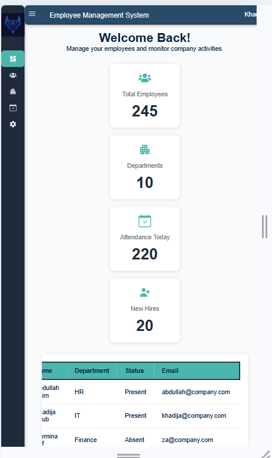

# Employee Management System Dashboard


A modern and responsive **Employee Management System Dashboard** built using **React** and **Vite**. This project demonstrates component-based architecture, client-side routing, reusable UI components, responsive design, and clean frontend development practices.

---

# 📖 Project Overview

The Employee Management System Dashboard is designed to provide administrators with a clean interface to manage employee-related information. It features a responsive dashboard layout with a collapsible sidebar, navigation, statistics cards, and an employee table.

This project was developed as part of a frontend development learning sprint to strengthen React fundamentals and build production-like UI components.

---

# ✨ Features

### 📊 Dashboard
- Employee statistics cards
- Welcome dashboard
- Company overview
- Responsive dashboard layout

### 🧭 Navigation
- React Router navigation
- Persistent sidebar
- Collapsible sidebar
- Active navigation highlighting
- Responsive navigation

### 👨‍💼 Employee Management
- Employee table
- Department information
- Attendance overview
- Status display

### 🎨 User Interface
- Responsive Design
- Modern Dashboard Layout
- Reusable React Components
- CSS Flexbox Layout
- Hover Effects & Smooth Transitions
- Mobile Friendly

---

# 🛠 Technologies Used

- React
- Vite
- JavaScript (ES6+)
- React Router DOM
- React Icons
- CSS3
- HTML5

---

# 📂 Folder Structure

```text
src/
│
├── assets/
│   └── logo.jpg
│
├── components/
│   ├── dashboard/
│   │   ├── EmployeeTable.jsx
│   │   └── StatCard.jsx
│   │
│   └── layout/
│       ├── DashboardLayout.jsx
│       ├── Header.jsx
│       └── Sidebar.jsx
│
├── pages/
│   ├── Dashboard.jsx
│   ├── Employees.jsx
│   ├── Departments.jsx
│   ├── Attendance.jsx
│   └── Settings.jsx
│
├── routes/
│   ├── AppRoutes.jsx
│
├── styles/
│   ├── dashboard.css
│   ├── header.css
│   ├── sidebar.css
│   ├── variables.css
│   ├── global.css
│   └── dashboardLayout.css
│ 
├── index.css  
├── App.jsx
└── main.jsx
```

---

# 🚀 Installation

### Clone the repository

```bash
git clone https://github.com/Khadija-Ayub/employee-management.git
```

### Navigate into the project

```bash
cd EMPLOYEE-MANAGEMENT-DASHBOARD
```

### Install dependencies

```bash
npm install
```

### Run the development server

```bash
npm run dev
```

---

# 📸 Screenshots

## 🏠 Dashboard


---

## 📊 Statistics Cards


---

## 👨‍💼 Employee Table


---

## 📱 Responsive Mobile View



---

# 🎯 Learning Objectives

This project focuses on practicing and understanding:

- Component-Based Architecture
- React Router
- Reusable Components
- Props
- State Management with `useState`
- Conditional Rendering
- Dynamic Rendering using `map()`
- Responsive Design
- CSS Flexbox
- Project Folder Organization
- Git & GitHub Workflow

---

# 🚧 Future Improvements

- Employee CRUD Operations
- Department CRUD
- Attendance Management
- Search Employees
- Filter Employees
- Authentication & Authorization
- Backend API Integration
- Database Connectivity
- Dark Mode
- User Profile
- Notifications
- Charts & Analytics

---

# 📈 Project Status

✅ Week 1 Completed

Completed:
- Dashboard Layout
- Sidebar
- Header
- Routing
- Statistics Cards
- Employee Table
- Responsive Design
- Documentation

Next:
- CRUD Operations
- Forms
- API Integration
- Authentication

---

# 👩‍💻 Author

**Khadija Ayub**

Frontend Developer | React Learner

GitHub:
https://github.com/Khadija-Ayub 

LinkedIn:
www.linkedin.com/in/khadija-ayub-0868b71b4


