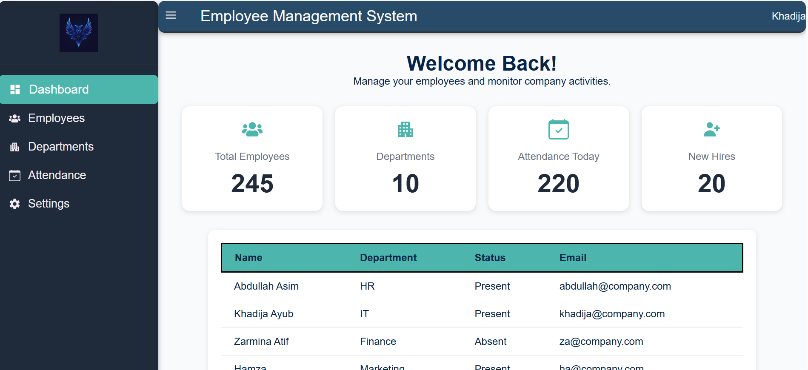
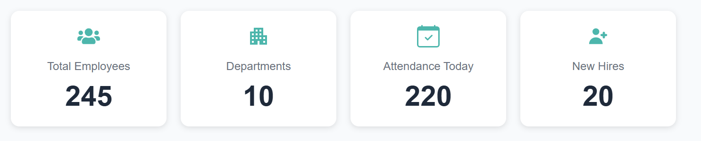
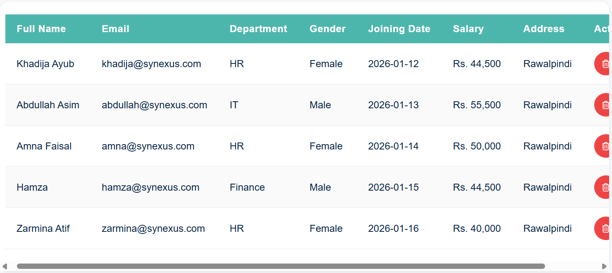
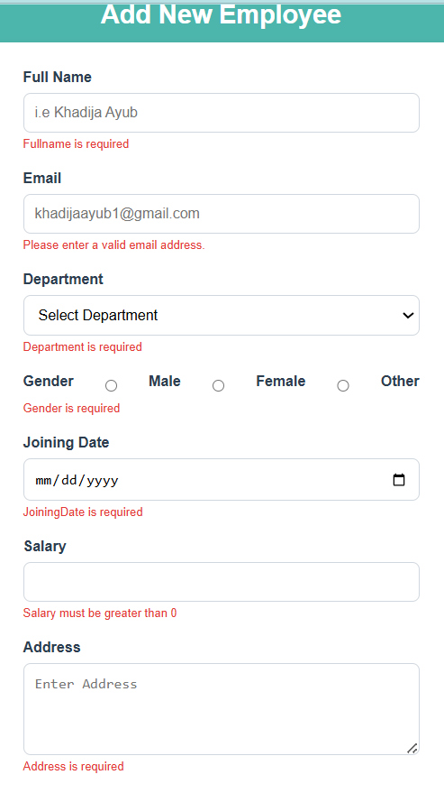
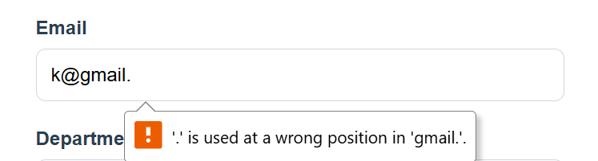
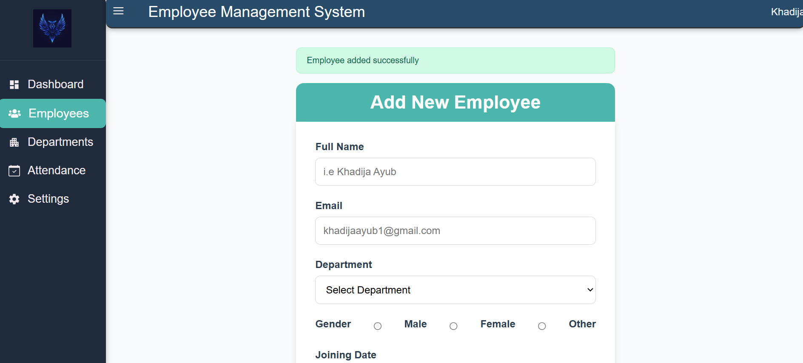

# Employee Management System Dashboard


A modern and responsive **Employee Management System Dashboard** built using **React** and **Vite**. The project demonstrates React fundamentals including reusable components, client-side routing, CRUD operations, controlled forms, state management, validation, and responsive UI design.

---

# 📖 Project Overview

The Employee Management System Dashboard provides administrators with an intuitive interface to manage employee information.

The project follows a **component-based architecture** and was developed to strengthen practical React development skills through real-world features such as:

- Dashboard Layout
- Employee CRUD
- Form Validation
- Responsive Design
- State Management
- React Router

---

# ✨ Features

## 📊 Dashboard

- Employee Statistics Cards
- Welcome Dashboard
- Company Overview
- Responsive Dashboard Layout

---

## 🧭 Navigation

- React Router Navigation
- Persistent Sidebar
- Collapsible Sidebar
- Active Navigation Highlighting
- Responsive Navigation

---

## 👨‍💼 Employee Management

- View Employees
- Add Employee
- Update Employee
- Delete Employee
- Responsive Employee Table
- Department Information
- Salary Formatting
- Empty Table State

---

## 📝 Employee Form

- Controlled Components
- Form Validation
- Success Messages
- Auto Form Reset
- Real-time Form Updates

---

## 🎨 User Interface

- Modern Dashboard Design
- Responsive Layout
- Reusable Components
- CSS Flexbox
- Hover Effects
- Smooth Transitions
- Mobile Friendly

---

# 🛠 Technologies Used

- React
- Vite
- JavaScript (ES6+)
- React Router DOM
- React Hooks (`useState`, `useEffect`)
- React Icons
- HTML5
- CSS3

---

# 📂 Folder Structure

```text
src/
│
├── assets/
│
├── components/
│   ├── dashboard/
│   │   ├── EmployeeTable.jsx
│   │   └── StatCard.jsx
│   │
│   ├── employees/
│   │   └── EmpForm.jsx
│   │
│   └── layout/
│       ├── DashboardLayout.jsx
│       ├── Header.jsx
│       └── Sidebar.jsx
│
├── pages/
│   ├── Dashboard.jsx
│   ├── Employees.jsx
│   ├── Departments.jsx
│   ├── Attendance.jsx
│   └── Settings.jsx
│
├── routes/
│   └── AppRoutes.jsx
│
├── styles/
│
├── App.jsx
├── main.jsx
└── index.css
```

---

# 🚀 Installation

## Clone the repository

```bash
git clone https://github.com/Khadija-Ayub/employee-management.git
```

## Navigate into the project

```bash
cd employee-management
```

## Install dependencies

```bash
npm install
```

## Start development server

```bash
npm run dev
```

---

# 📸 Screenshots

## 🏠 Dashboard



---

## 📊 Statistics Cards



---

## 👨‍💼 Employee Table



---

## ➕ Add Employee Form


---


# ✅ Validation Scenarios

The Employee Form performs client-side validation before allowing data submission.

| Scenario | Expected Result |
|-----------|----------------|
| Full Name is empty | Error message displayed |
| Invalid Email | Error message displayed |
| Department not selected | Error message displayed |
| Gender not selected | Error message displayed |
| Joining Date missing | Error message displayed |
| Salary ≤ 0 | Error message displayed |
| Address is empty | Error message displayed |
| Valid Form Submission | Employee added successfully |
| Employee Update | Existing employee updated |
| Employee Delete | Employee removed successfully |
| No Employees Available | "No Employees Found" message displayed |

---

# 📷 Validation Screenshots

### Empty Form Validation



---

### Invalid Email Validation



---

### Successful Employee Addition



---

# 📚 React Concepts Practiced

- Functional Components
- Component-Based Architecture
- Props
- Callback Props
- State Lifting
- useState
- useEffect
- Controlled Components
- Conditional Rendering
- Form Validation
- Dynamic Rendering using `map()`
- Array Filtering using `filter()`
- Updating Arrays using `map()`
- Event Handling

---

# 🎯 Learning Objectives

This project helped strengthen practical understanding of:

- React Fundamentals
- CRUD Operations
- State Management
- Form Handling
- Controlled Components
- Callback Functions
- useEffect
- React Router
- Responsive Design
- Component Reusability
- Git & GitHub Workflow

---

# 🚧 Future Improvements

- Search Employees
- Filter Employees
- Sort Employees
- Pagination
- Department CRUD
- Attendance Management
- Backend API Integration
- Database Connectivity
- Authentication
- Charts & Analytics
- Dark Mode

---

# 📈 Project Status

## ✅ Week 1 Completed

- Dashboard Layout
- Sidebar
- Header
- Routing
- Statistics Cards
- Employee Table
- Responsive Design

---

## ✅ Week 2 Completed

- Employee CRUD
- Add Employee
- Update Employee
- Delete Employee
- Controlled Forms
- Form Validation
- Success Messages
- React State Management
- Callback Props
- useEffect
- Responsive Employee Form
- Responsive Employee Table

---

## 🚀 Upcoming Features

- Search Functionality
- Filters
- Sorting
- Backend Integration
- Authentication

---

# 👩‍💻 Author

**Khadija Ayub**

Frontend Developer | React Learner

### GitHub

https://github.com/Khadija-Ayub

### LinkedIn

https://www.linkedin.com/in/khadija-ayub-0868b71b4

---