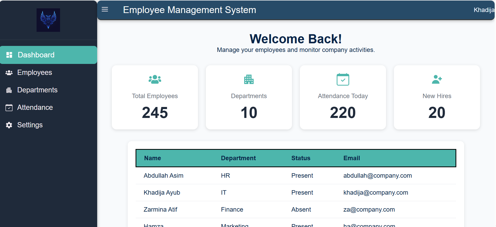
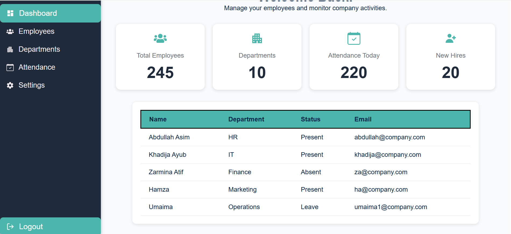
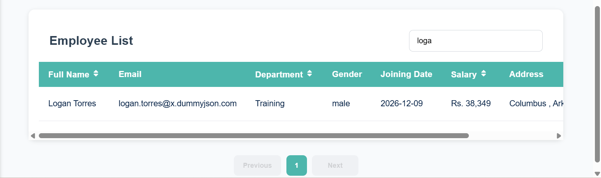
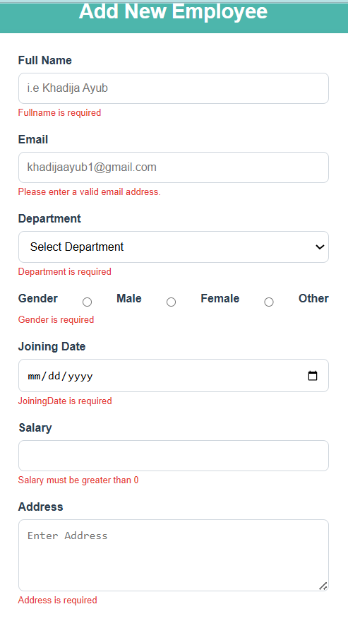
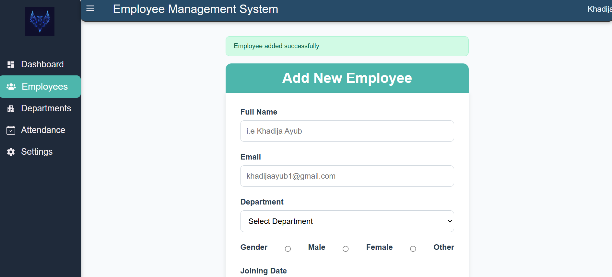
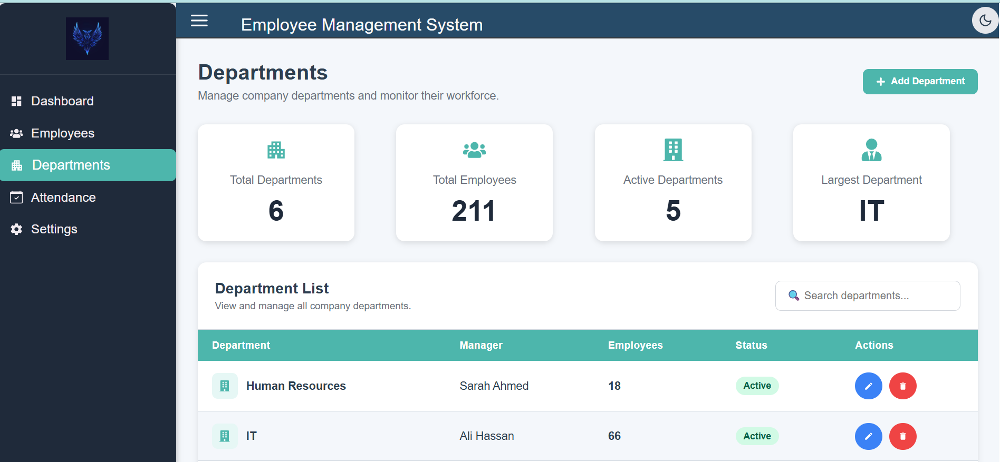
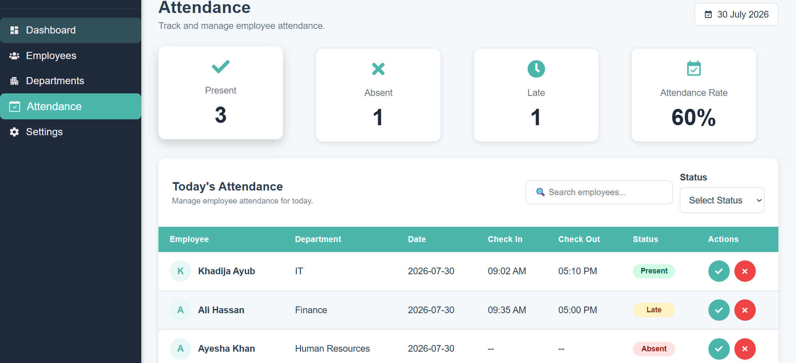
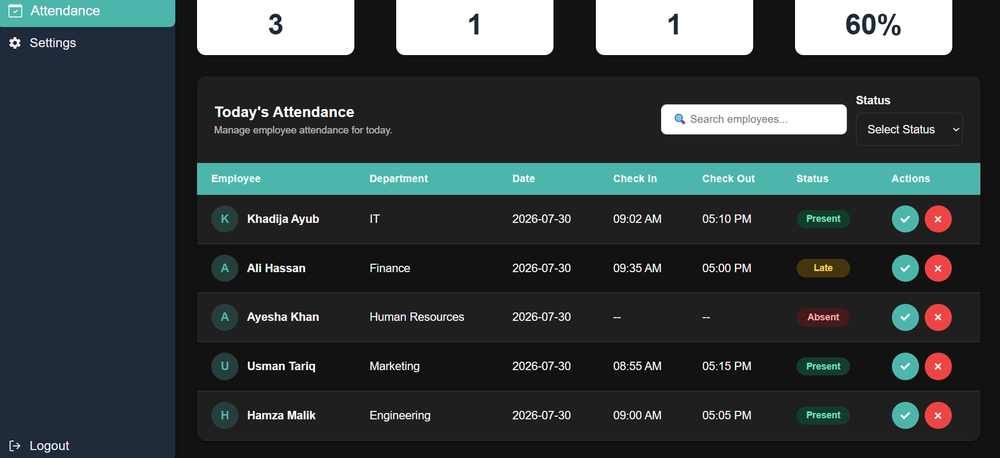

# Employee Management System Dashboard


A modern, responsive **Employee Management System Dashboard** built with
**React 19 and Vite**. The project is designed as a practical frontend
application for managing employees, departments, attendance, and
dashboard statistics.

It demonstrates React fundamentals and real-world frontend development
practices including **reusable components, CRUD operations, controlled
forms, validation, API integration, search, sorting, pagination,
routing, state management, responsive design, accessibility
improvements, and light/dark themes**.

------------------------------------------------------------------------

## 📌 Project Overview

The Employee Management System Dashboard provides an
administrator-friendly interface for viewing and managing company
information.

The application is organized around reusable React components rather
than repeating UI code throughout individual pages. Common elements such
as buttons, form fields, selects, radio groups, search inputs, and
statistic cards can be reused across the application.

### Main Modules

-   Dashboard
-   Employee Management
-   Department Management
-   Attendance
-   Settings
-   Responsive Sidebar Navigation
-   Light/Dark Theme

------------------------------------------------------------------------
# 📸 Screenshots


## 🏠 Dashboard



The main dashboard showing the application layout, navigation, and
statistics.

------------------------------------------------------------------------

## 👨‍💼 Employee Management



Employee table showing employee information, actions, pagination, and
table layout.

------------------------------------------------------------------------

## 🔍 Search



Demonstrates employee searching.

------------------------------------------------------------------------

## 📝 Employee Form & Validation



Demonstrates client-side form validation and error messages.

------------------------------------------------------------------------

## ✅ Successful Employee Operation



Displays the success message after an employee is added or updated.

------------------------------------------------------------------------

## 🏢 Department Management



Department management page showing department statistics, employee
counts, status badges, and actions.

------------------------------------------------------------------------

## 📅 Attendance



Attendance overview showing attendance statistics and employee
attendance information.

------------------------------------------------------------------------

## 🌙 Dark Mode



Dark theme applied consistently across the dashboard UI.

------------------------------------------------------------------------

# ✨ Features

## 📊 Dashboard

The dashboard provides a quick overview of the organization.

-   Welcome section
-   Employee statistics
-   Department statistics
-   Attendance statistics
-   New hire statistics
-   Reusable `StatCard` component
-   Responsive dashboard layout
-   Clean card-based UI

------------------------------------------------------------------------

## 🧭 Navigation & Layout

-   React Router based navigation
-   Persistent sidebar
-   Collapsible sidebar
-   Active route highlighting
-   Responsive navigation
-   Hamburger menu for smaller screens
-   Header controls
-   Light/Dark mode toggle

------------------------------------------------------------------------

## 👨‍💼 Employee Management

The Employees page provides complete client-side employee management.

### Employee Operations

-   View employees
-   Add employees
-   Update employees
-   Delete employees
-   Search employees
-   Paginate employees
-   Sort employees

### Sorting

Employees can be sorted by:

-   Full Name
-   Department
-   Salary

Sorting controls include visual sort indicators for ascending and
descending order.

### Table States

-   Loading skeleton
-   Error state
-   Empty state
-   Responsive horizontal scrolling
-   Formatted salary values
-   Action buttons with icons

------------------------------------------------------------------------


## 📝 Employee Form

The employee form uses controlled React inputs and reusable form
components.

### Form Features

-   Full name
-   Email
-   Department
-   Gender
-   Joining date
-   Salary
-   Address
-   Add employee
-   Update employee
-   Form reset after submission
-   Success messages
-   Client-side validation

### Validation

The form validates:

-   Required full name
-   Valid email format
-   Required department
-   Required gender
-   Required joining date
-   Salary greater than zero
-   Required address

Error messages are displayed next to the corresponding field.

------------------------------------------------------------------------

# ♻️ Reusable Component Architecture

A major focus of the project is reducing duplicated UI code through
reusable components.

### Common Components

  Component       Purpose
  --------------- -----------------------------------------------------------
  `Button`        Reusable buttons with variants, sizes, icons, and actions
  `FormField`     Reusable text, number, date, and textarea fields
  `Select`        Reusable dropdown/select field
  `RadioGroup`    Reusable radio-button group
  `SearchInput`   Reusable search field
  `StatCard`      Reusable statistics card

For example, instead of writing separate markup for every form field,
`FormField` receives props such as:

-   `label`
-   `name`
-   `type`
-   `value`
-   `onChange`
-   `placeholder`
-   `error`
-   `required`
-   `as`
-   `rows`

This keeps the pages smaller, consistent, and easier to maintain.

------------------------------------------------------------------------

# 🏢 Department Management

The Departments page provides a simple department administration
interface.

### Features

-   Department statistics
-   Department list
-   Manager information
-   Employee count per department
-   Active/Inactive status
-   Add department
-   Edit department
-   Delete department
-   Department modal
-   Department form
-   Reusable statistic cards
-   Responsive department table

### Dynamic Statistics

The total number of departments is calculated from the department state.

The total employee count is calculated dynamically using the department
employee counts rather than being hardcoded.

This ensures that editing or adding departments automatically updates
the relevant statistics.

------------------------------------------------------------------------

# 📅 Attendance

The Attendance page provides a simple overview of employee attendance.

### Features

-   Attendance statistics
-   Present employees
-   Absent employees
-   Late employees
-   Attendance percentage
-   Attendance table
-   Status indicators
-   Responsive layout
-   Reusable statistic cards

The page is intentionally kept simple while maintaining the same design
language as the rest of the dashboard.

------------------------------------------------------------------------

# 🌙 Light & Dark Mode

The application supports both light and dark themes.

The theme is implemented using CSS custom properties and a theme
attribute.

Example:

``` html
data-theme="dark"
```

Common colors such as:

-   Background
-   Surface
-   Text
-   Headings
-   Borders
-   Primary color
-   Hover colors
-   Table hover states

are controlled through CSS variables.

This makes the theme easier to maintain and prevents individual pages
from requiring completely separate dark-mode styles.

------------------------------------------------------------------------

# ♿ Accessibility Improvements

Accessibility was considered while building reusable components.

Examples include:

-   Semantic HTML elements
-   Proper `label` and `input` relationships
-   `htmlFor` usage
-   Button `type` attributes
-   Descriptive `aria-label` values for icon-only actions
-   `aria-invalid` for invalid form controls
-   `aria-describedby` for form error messages
-   Keyboard-friendly buttons
-   Accessible sortable table controls

------------------------------------------------------------------------

# 🌐 API Integration

Employee data is fetched from the **DummyJSON Users API**.

### Endpoint

``` text
https://dummyjson.com/users
```

The API response is transformed into the application's employee data
model before being displayed.

The application handles:

-   API loading state
-   Loading skeleton
-   API error state
-   Empty state
-   Data transformation

------------------------------------------------------------------------

# 🛠️ Technologies Used

-   **React 19**
-   **Vite**
-   **JavaScript ES6+**
-   **React Router DOM**
-   **React Hooks**
    -   `useState`
    -   `useEffect`
-   **Fetch API**
-   **React Icons**
-   **HTML5**
-   **CSS3**
-   **CSS Custom Properties**
-   **Responsive CSS**
-   **Flexbox**
-   **CSS Grid**

------------------------------------------------------------------------

# 📂 Project Structure

``` text
src/
│
├── assets/
│
├── components/
│   │
│   ├── common/
│   │   ├── Button.jsx
│   │   ├── FormField.jsx
│   │   ├── RadioGroup.jsx
│   │   ├── SearchInput.jsx
│   │   └── Select.jsx
│   │
│   ├── dashboard/
│   │   ├── EmployeeTable.jsx
│   │   ├── LoadingSkeleton.jsx
│   │   └── StatCard.jsx
│   │
│   ├── employees/
│   │   └── EmpForm.jsx
│   │
│   └── layout/
│       ├── DashboardLayout.jsx
│       ├── Header.jsx
│       └── Sidebar.jsx
│
├── pages/
│   ├── Dashboard.jsx
│   ├── Employees.jsx
│   ├── Departments.jsx
│   ├── Attendance.jsx
│   └── Settings.jsx
│
├── routes/
│   └── AppRoutes.jsx
│
├── styles/
│   ├── common.css
│   ├── dashboard.css
│   ├── employee.css
│   ├── department.css
│   ├── attendance.css
│   ├── layout.css
│   └── ...
│
├── App.jsx
├── main.jsx
└── index.css
```

------------------------------------------------------------------------

# 🔄 Application Flow

``` text
App
 │
 ├── AppRoutes
 │
 └── DashboardLayout
      │
      ├── Sidebar
      ├── Header
      │
      └── Page Content
           │
           ├── Dashboard
           ├── Employees
           │    ├── Employee Form
           │    └── Employee Table
           │
           ├── Departments
           │    ├── Department Stats
           │    ├── Department Table
           │    └── Department Modal
           │
           ├── Attendance
           │
           └── Settings
```

------------------------------------------------------------------------

# 🧠 React Concepts Practiced

This project was built to practice and strengthen practical React
concepts.

### Components & Props

-   Functional components
-   Reusable components
-   Props
-   Callback props
-   Component composition

### State & Effects

-   `useState`
-   `useEffect`
-   State lifting
-   Derived state
-   Updating arrays immutably

### Rendering

-   Conditional rendering
-   Dynamic rendering with `map()`
-   Empty states
-   Loading states
-   Error states

### Data Operations

-   `filter()`
-   `sort()`
-   `slice()`
-   `reduce()`
-   API data transformation

### Forms

-   Controlled components
-   Form validation
-   Reusable form fields
-   Error handling
-   Form submission
-   Form reset

### UI Development

-   Responsive design
-   Flexbox
-   CSS Grid
-   CSS variables
-   Theme switching
-   Hover effects
-   Transitions
-   Reusable styling patterns

### Routing

-   React Router
-   Route-based pages
-   Active navigation state

------------------------------------------------------------------------

# 🧪 Validation Scenarios

  Scenario                  Expected Result
  ------------------------- -------------------------------
  Full Name is empty        Error message displayed
  Invalid Email             Error message displayed
  Department not selected   Error message displayed
  Gender not selected       Error message displayed
  Joining Date missing      Error message displayed
  Salary is 0 or negative   Error message displayed
  Address is empty          Error message displayed
  Valid form submission     Employee added successfully
  Employee update           Existing employee updated
  Employee deletion         Employee removed successfully
  No matching employees     Empty state displayed
  API loading               Loading skeleton displayed
  API failure               Error state displayed

------------------------------------------------------------------------


# 🚀 Installation & Setup

## 1. Clone the repository

``` bash
git clone https://github.com/Khadija-Ayub/employee-management.git
```

## 2. Navigate into the project

``` bash
cd employee-management
```

## 3. Install dependencies

``` bash
npm install
```

## 4. Start the development server

``` bash
npm run dev
```

## 5. Open the application

Vite will provide a local development URL in the terminal, typically:

``` text
http://localhost:5173
```

------------------------------------------------------------------------

# 📦 Production Build

To create a production build:

``` bash
npm run build
```

To preview the production build locally:

``` bash
npm run preview
```

------------------------------------------------------------------------

# 📋 Project Highlights

The project demonstrates more than basic CRUD functionality by combining
multiple frontend concepts into one application:

-   Component-based React architecture
-   Reusable UI components
-   Reusable form components
-   Reusable statistics cards
-   API integration
-   CRUD operations
-   Search and sorting
-   Pagination
-   Form validation
-   Loading and error states
-   Responsive design
-   Accessibility practices
-   Light/Dark theme
-   React Router navigation
-   Dynamic statistics
-   Department management
-   Attendance overview

------------------------------------------------------------------------

# 🔮 Possible Future Improvements

The current application focuses on frontend functionality. Possible
future improvements include:

-   Backend database integration
-   Authentication and authorization
-   Persistent employee and department data
-   Real attendance records
-   Advanced employee filtering
-   Department-based employee filtering
-   Employee profile pages
-   Export employees to CSV/PDF
-   Charts and analytics
-   Backend validation
-   Toast notification system

------------------------------------------------------------------------

# 👩‍💻 Author

**Khadija Ayub**

Frontend Developer \| React Learner

### GitHub

https://github.com/Khadija-Ayub

### LinkedIn

https://www.linkedin.com/in/khadija-ayub-0868b71b4

------------------------------------------------------------------------


